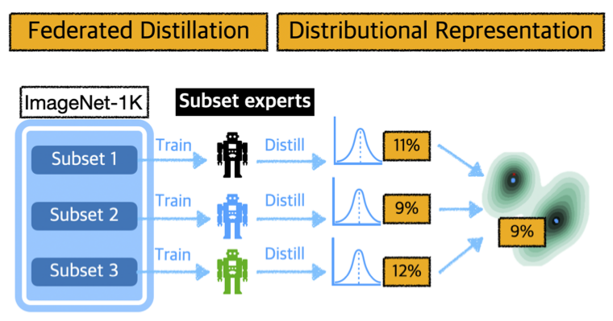

# Distributional Dataset Distillation with Subtask Decomposition

<!-- ### [Project Page](https://georgecazenavette.github.io/mtt-distillation/) | [Paper](https://arxiv.org/abs/2203.11932) -->
<br>

This repo contains code for Distributional Dataset Distillation with Subtask Decomposition. 



## Basic Setup

First, download our repo:
```bash
git clone https://github.com/sunnytqin/D3.git
cd D3
```

Make sure the following pacakages are installed in your environment:   
```
torch==1.13.1  
torchvision==0.14.1  
kornia==0.6.12  
einops==0.6.1  
numpy==1.20.1  
tqdm==4.64.1
wandb==0.13.8
scipy==1.10.1
```

See `requirements.txt` for an exhaustive list of dependencies

## Evaluate our Distilled Distribution
First, download our distilled distribution from [here](https://drive.google.com/drive/folders/10LhYDZ915HFHvd4JzYA5BGJX2A7jfG6t?usp=sharing), and place under folder `checkpoints/`

Second, download resized ImageNet-1K (64 $\times$ 64)

To evaluate our distilled distribution (smallest budget, 1 IPC equivalent) on ImageNet-1K: 
```bash
python eval_federated.py --dataset=ImageNet64  --decoder_size=small --lpc=1 --num_subtasks=5 --z_dim=64 --kernel_num=256 --lr_teacher=5.e-02 --num_eval=1 --eval_mode=S  --epoch_eval_train 2000 --soft_label --data_path={path_to_ImageNet64_dataset}
```

See `clearn_script.md` for commands to evaluate the distilled distribution under all three budgets on ImageNet-1K and TinyImagNet under 10 IPC equivalent storage budget.


## Distributional Distillation Pipeline

### 1. Generating Subtask Experts
Before doing any distillation, you'll need to generate subtask experts using `buffer.py`

Train 100 ConvNet models on ImageNet subsets: 
```bash
python buffer.py --dataset=ImageNet64 --subset=imagebatch_0 --model=ConvNet --train_epochs=10 --num_experts=100 --save_interval 10 --buffer_path={custom_buffer_path} --data_path={path_to_ImageNet64_dataset} 
```

### 2. Distributional Distillation on subtasks 
Distill each of the subsets (in parallel):
```bash
python distill_distribution.py --dataset=ImageNet64 --subset=imagebatch_0 --decoder_size=small --lpc=1 --syn_steps=10 --expert_epochs=2 --max_start_epoch=27 --kernel_num=256 --lr_latent=3e-04 --lr_lr=1e-06 --lr_teacher=1e-02 --lr_decode=3e-04 --Iteration 10000 --num_eval=1 --eval_mode=S --epoch_eval_train 2000 --eval_it 200 --load_all --expt_name=small --buffer_path={custom_buffer_path} --data_path={path_to_ImageNet64_dataset}
```

Remember to repeat step 1 and step 2 for all substasks: `--subset=imagebatch_${i}`, `i` $\in \lbrace 0, 1, 2, 3, 4\rbrace$.

### 3. Evaluation
Assign softlabels and evaluate the performance on ImageNet-1K val set after all substasks have been distilled
```bash
python soft_label.py --dataset=ImageNet64  --decoder_size=small --lpc=1 --num_subtasks=5 --expert_epochs=9  --z_dim=64 --kernel_num=256 --lr_teacher=5.e-02 --num_eval=1 --eval_mode=S --epoch_eval_train 2000 --soft_label --buffer_path={custom_buffer_path}  --data_path={path_to_ImageNet64_dataset}
```

## Full reproducibility
See `clearn_script.md` for commands (and non-default hyperprameters used) to distill all three budgets (1, 2, 10 IPC equivalent) on ImageNet-1K and TinyImagNet (under a budget of 10 IPC equivalent)
